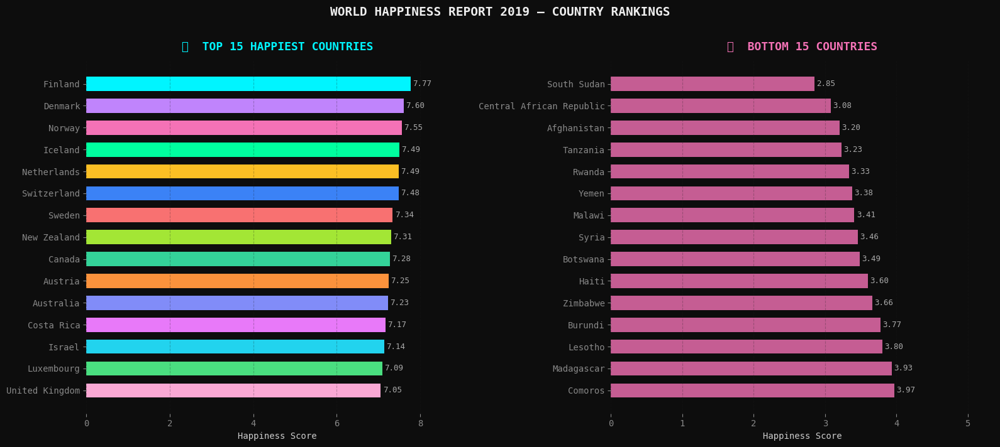
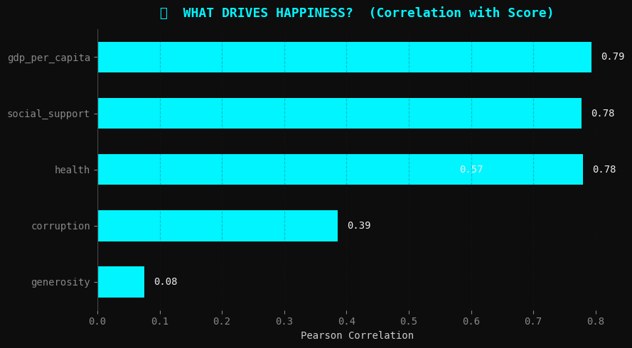
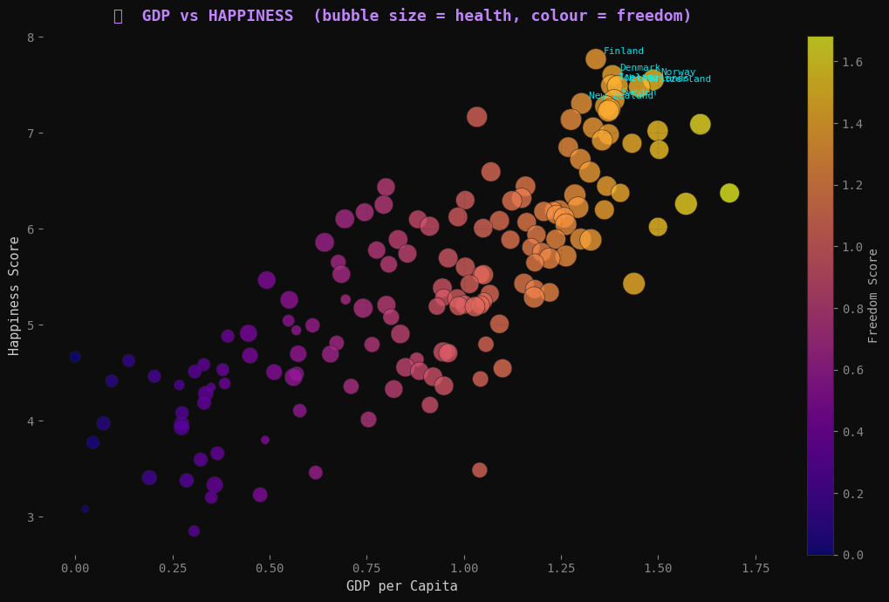
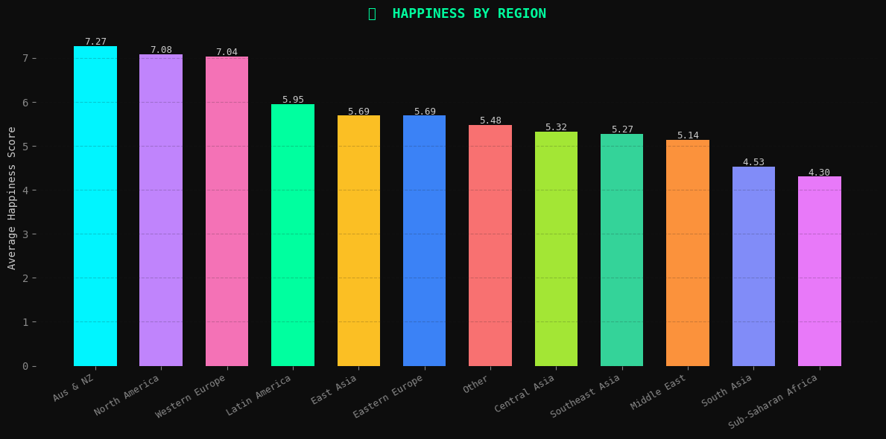
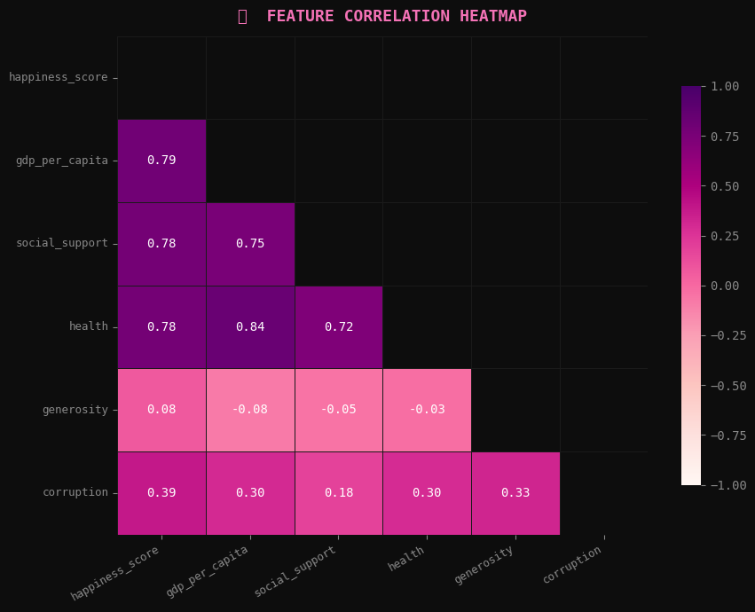

# 🌍 World Happiness EDA — What Makes Countries Happy?

Exploratory Data Analysis on the **2019 World Happiness Report** dataset covering 156 countries.

---

## 📊 Charts

### 🏆 Top 15 vs Bottom 15 Countries

### 📊 What Drives Happiness?

### 💰 GDP vs Happiness

### 🌏 Happiness by Region

### 🔥 Feature Correlation Heatmap

---

## 🔍 Key Findings

- 🏆 **Happiest country:** Finland (7.77)
- 📉 **Least happy:** South Sudan (2.85)
- 📈 **Global average:** 5.41
- 💰 **GDP** (r = 0.79) and **Social Support** (r = 0.78) are the strongest predictors of happiness
- 🎁 **Generosity** (r = 0.08) has almost no direct impact — the most surprising finding
- 🌏 **Western Europe** consistently ranks highest by region; **Sub-Saharan Africa** lowest

---

## 🛠️ Tech Stack

---

*Data source: World Happiness Report 2019*
*Built by [@nandhika0422](https://github.com/nandhika0422)*
